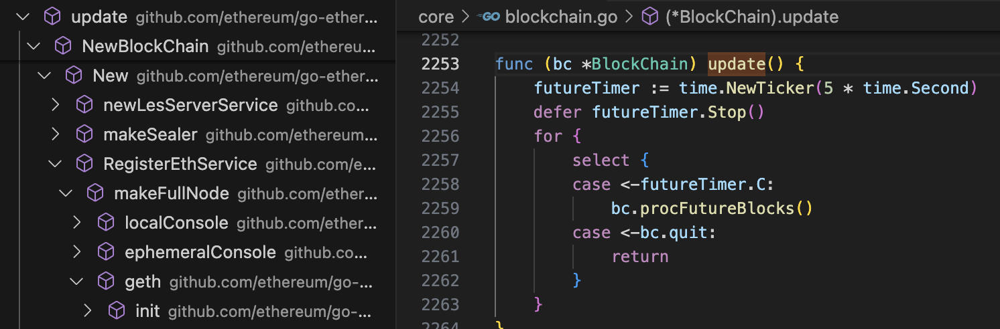
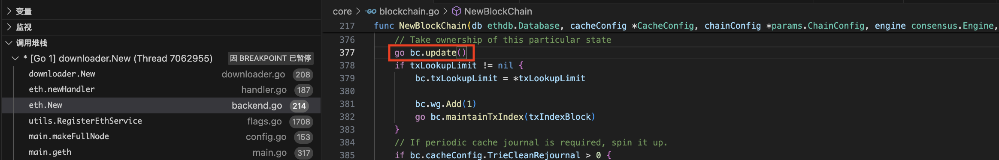
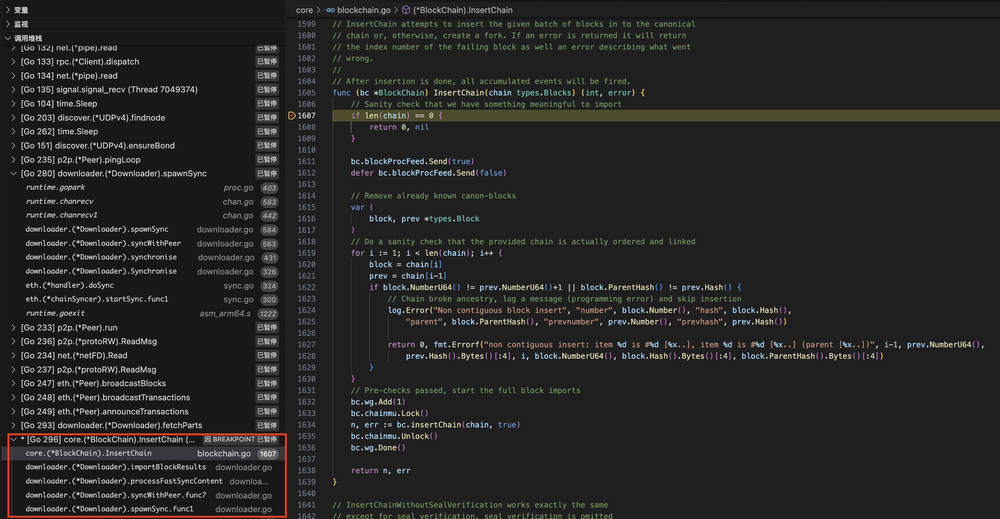
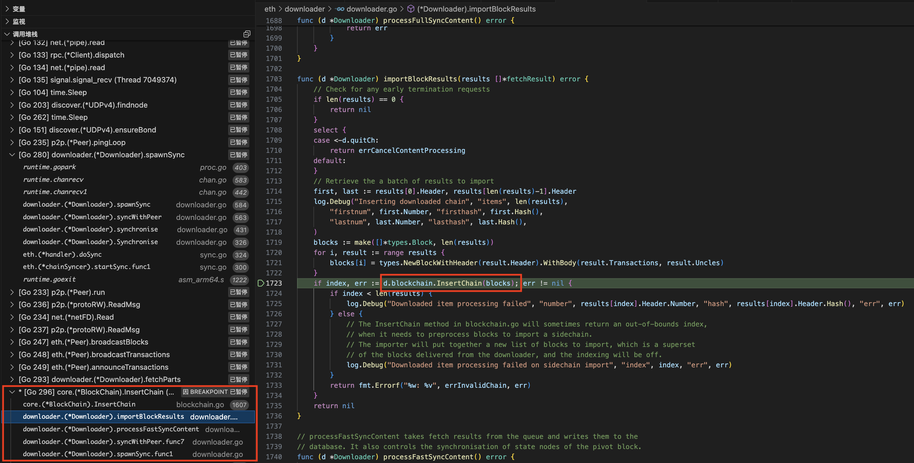
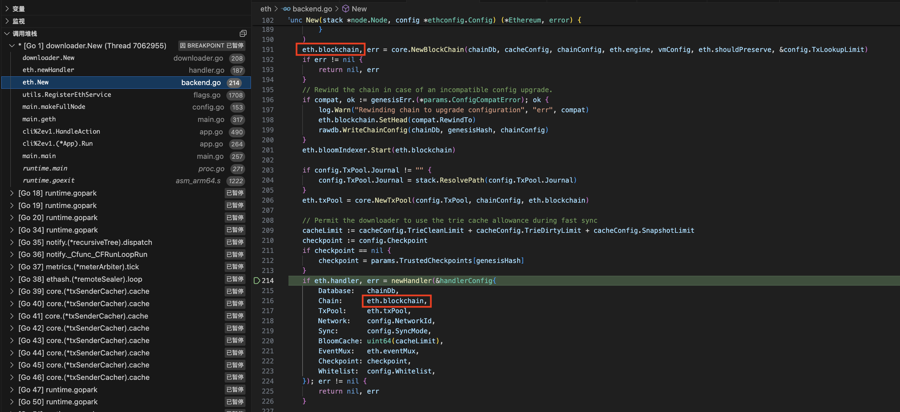

# Peer之间的`Block`同步流程

* blockchain的update
    
    * blockchain的update自己就是一个goroutine
    

* 和downloader的`Block`同步交互
    * 在InsertChain里面加上断点
        
    * 可以看到在downloader里面调用了blockchain的`InsertChain`函数
        

* blockchain在eth和downloader里面通过config共享同一个对象。
    
    