# go-ethereum-comment
reading go-ethereum code, analyze and comment it.

主要阅读的go-ethereum的版本为：`1.10.7`

## 基本概念
### Total Difficult
当前的**总难度**：由从genesis块开始到当前块的难度**累加和**。

1. 第一步，在挖矿的时候，计算Difficulty值，并将该值保存到每一个Block(包括Uncle)的Header里。
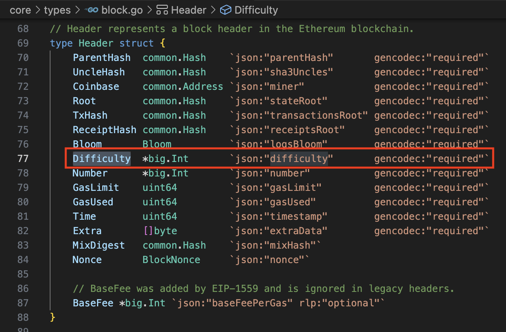
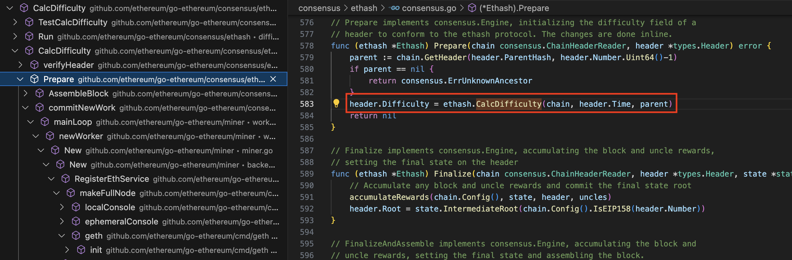
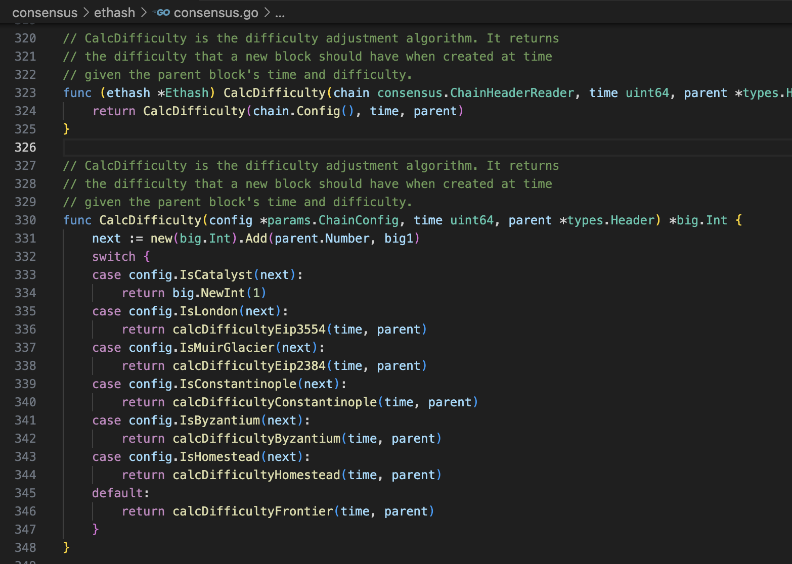

在此列举两个计算Difficulty的算法：
[https://github.com/ethereum/EIPs/issues/100](https://github.com/ethereum/EIPs/issues/100)
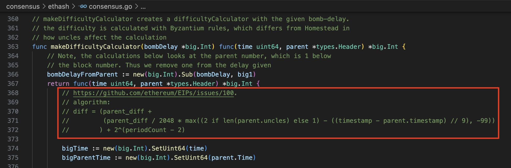
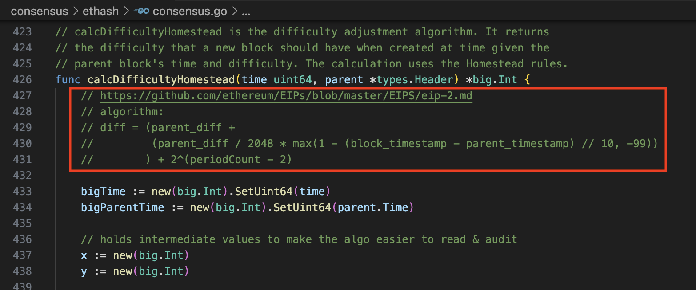

2. 校验难度值的时候，也用CalcDifficulty函数
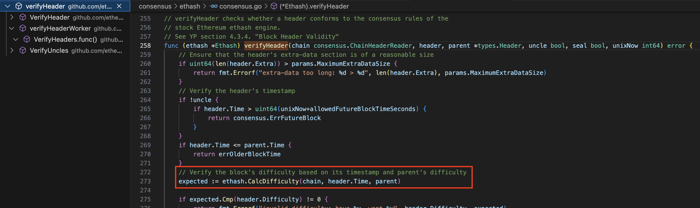
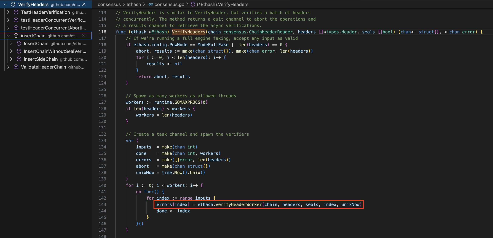
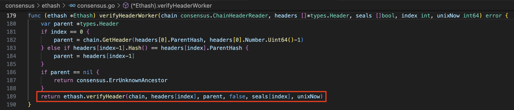

3. 在insertChain里面动态的累加到Database的**Total Difficulty**中。
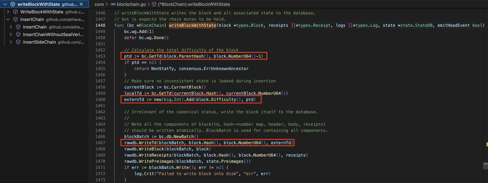

* 每次insertChain的调用，最初都是从genesis块开始的
* 可能有分枝，但是所在的分枝最初也是从genesis块开始累加Difficulty值到**Total Difficulty**里面
* 因为有snapshot的存在，这里的**Total Difficulty**的计算可能被优化
* 该Td值也会缓存到数据库里面，在重启客户端的时候有用到，不能只保存的内存中。
* 每个Block在本地Database里都有一个**Total Difficulty**值可用

本来以为，在insertChain里面动态的累加到Block的临时变量**td**里面，但是通过仔细查找后发现，这个**td**值在代码里面没有被使用！而是通过读写数据库来直接获取和写入**Total Difficulty**值。基本上确认！
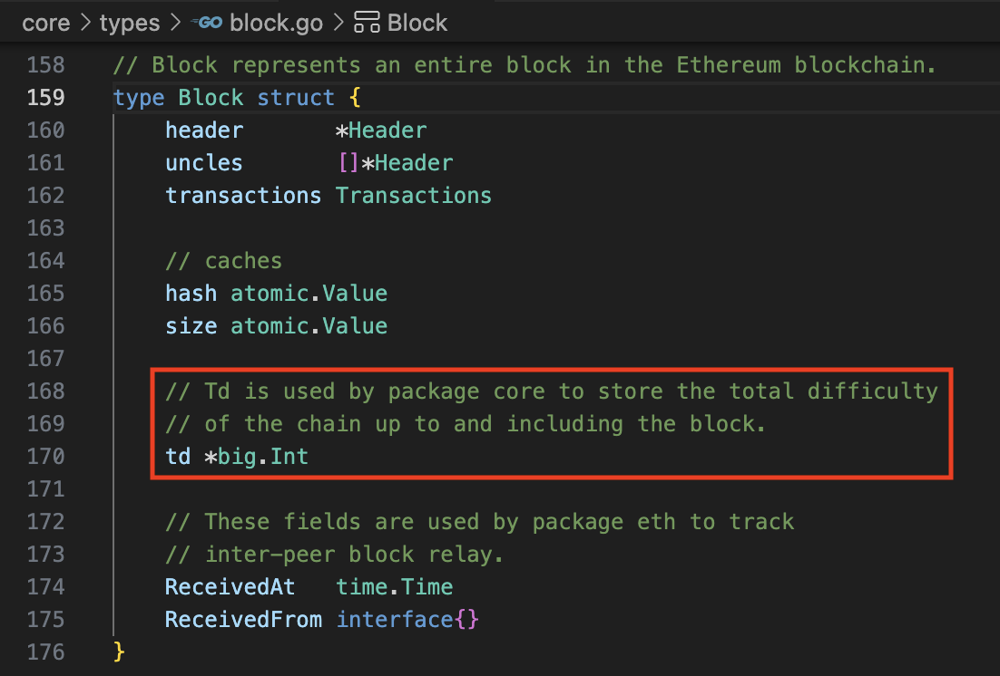

### 以太坊难度计算详解
参考链接；[https://zhuanlan.zhihu.com/p/140750633](https://zhuanlan.zhihu.com/p/140750633)

首先了解以太坊的各个发展阶段的名称：
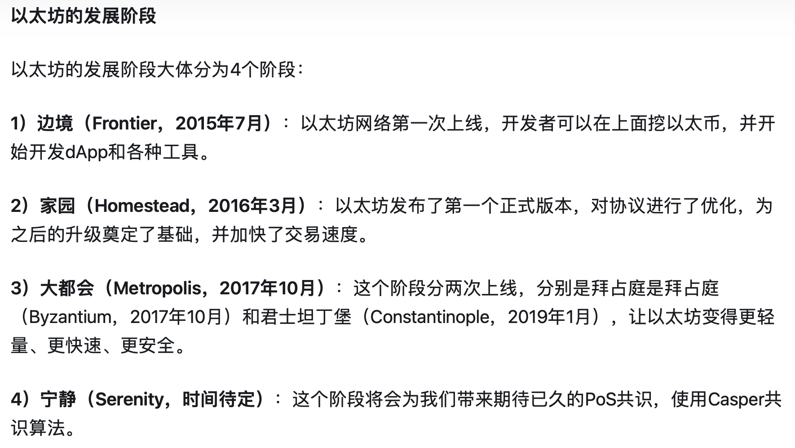

仔细看看以下四个计算Difficulty的函数：
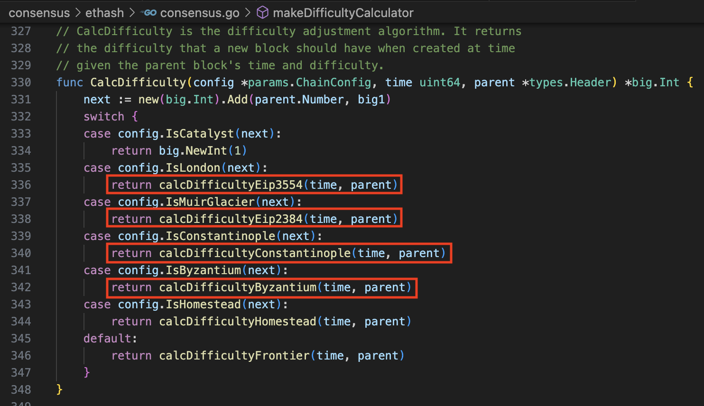
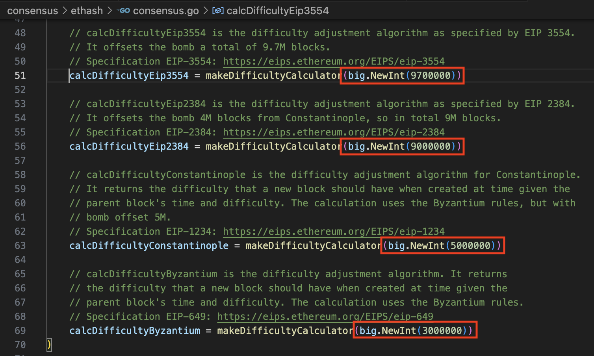

都是通过同一个函数（或者称其为：数学公式）`makeDifficultyCalculator`来生成的。
**区别**仅限于推迟难度炸弹的Block数量。
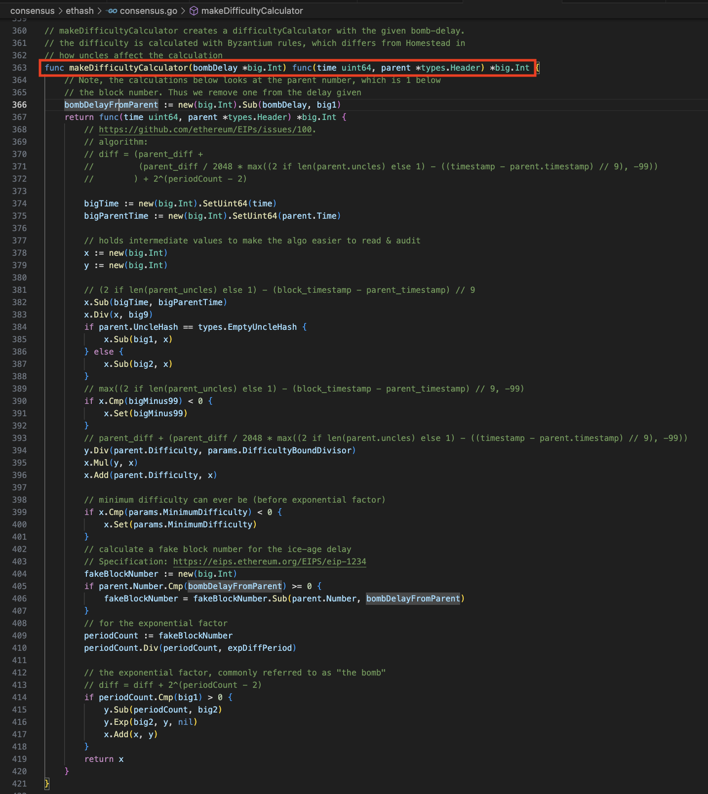

要想了解上面的这个`makeDifficultyCalculator`函数的数学公式究竟干了什么，请仔细阅读这篇PDF文档:

* [http://zhenxiao.com/blockchain/20-ETH.pdf](http://zhenxiao.com/blockchain/20-ETH.pdf)

* [doc/20-ETH.pdf](doc/20-ETH.pdf)

该文档详细说明了以太坊的难度计算细节。

### Node Object
一个客户端，包含各种服务goroutine

1. 管理account
2. 管理P2P对象
3. 提供HTTP，WebSocket，IPC，RPC的服务对象

### Ethereum Object
处理以太坊区块链相关的服务对象

1. 新来的区块处理
2. 区块链处理
3. 交易池管理
4. 挖矿管理
5. API管理：console可以访问的一系列接口；通过JavaScript脚本操作

### Database的schema

主要是各种key的常量。用来持久化大量的缓存变量。例如：TotalDifficulty

## 基本流程

* downloader下载得到的block通过blockchain的InsertChain添加到区块链中。

* blockchain在eth和downloader里面通过config共享同一个对象。

### blockchain update

BlockChain的SetHeadBeyondRoot直接设定当前链。reorg最长链分枝的时候，也是调用SetHeadBeyondRoot函数。

### downloader
### 启动geth

## 主要流程

### 本地同步流程
#### 如何存盘
#### 如何处理分叉

