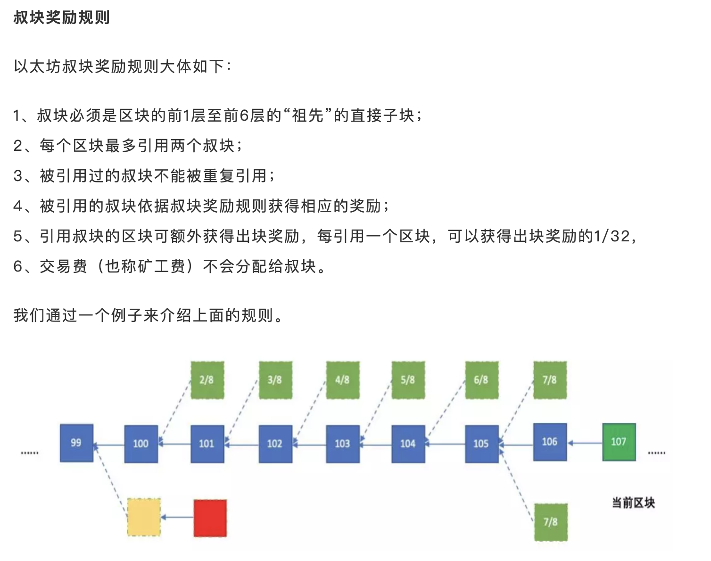
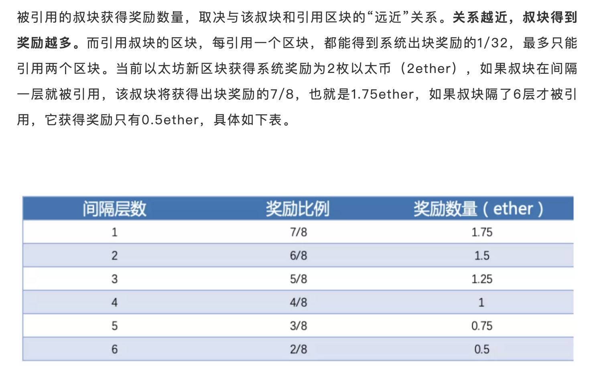
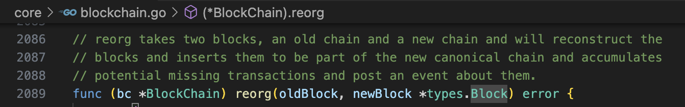
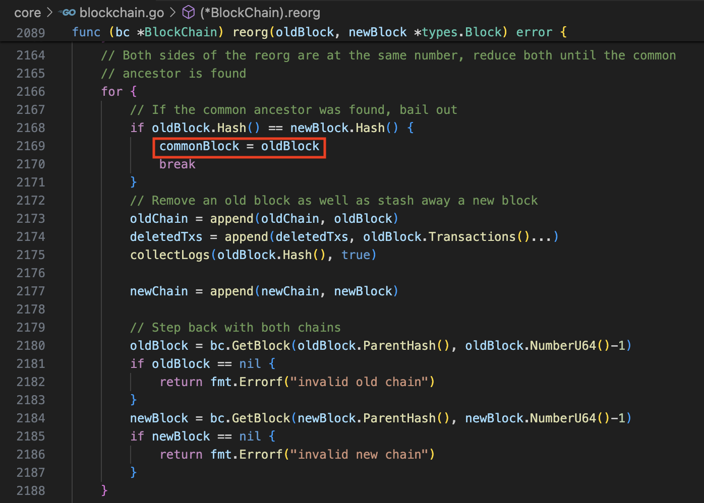
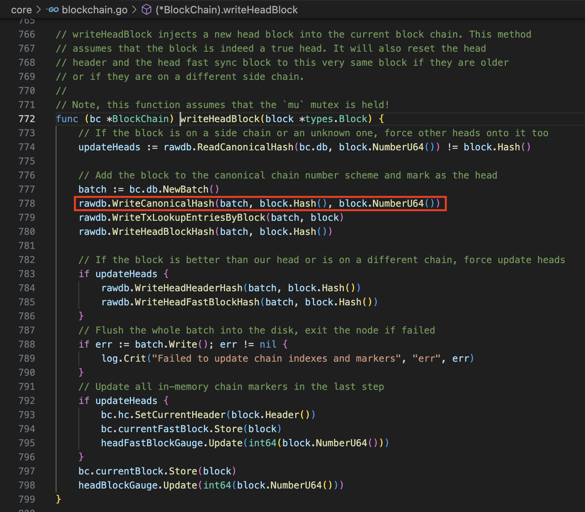
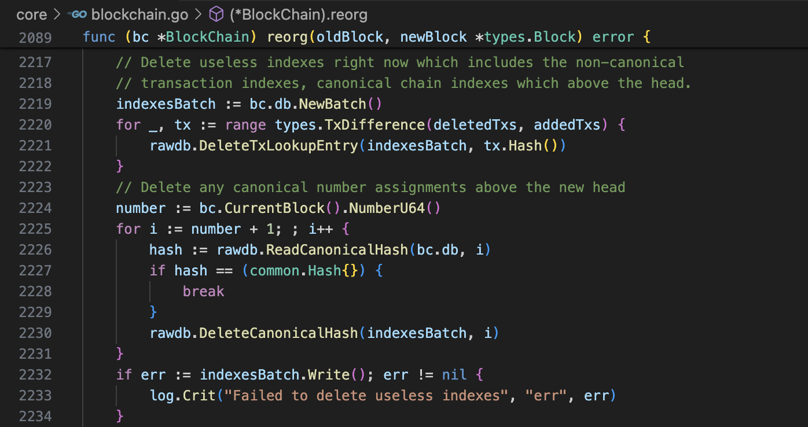

# go-ethereum-comment
reading go-ethereum code, analyze and comment it.

主要阅读的go-ethereum的版本为：`1.10.7`

## 基本概念
### Total Difficult
当前的**总难度**：由从genesis块开始到当前块的难度**累加和**。

1. 第一步，在挖矿的时候，计算Difficulty值，并将该值保存到每一个Block(包括Uncle)的Header里。

在此列举两个计算Difficulty的算法：
[https://github.com/ethereum/EIPs/issues/100](https://github.com/ethereum/EIPs/issues/100)

2. 校验难度值的时候，也用CalcDifficulty函数

3. 在insertChain里面动态的累加到Database的**Total Difficulty**中。

* 每次insertChain的调用，最初都是从genesis块开始的
* 可能有分枝，但是所在的分枝最初也是从genesis块开始累加Difficulty值到**Total Difficulty**里面
* 因为有snapshot的存在，这里的**Total Difficulty**的计算可能被优化
* 该Td值也会缓存到数据库里面，在重启客户端的时候有用到，不能只保存的内存中。
* 每个Block在本地Database里都有一个**Total Difficulty**值可用

本来以为，在insertChain里面动态的累加到Block的临时变量**td**里面，但是通过仔细查找后发现，这个**td**值在代码里面没有被使用！而是通过读写数据库来直接获取和写入**Total Difficulty**值。基本上确认！

### 以太坊难度计算详解
参考链接；[https://zhuanlan.zhihu.com/p/140750633](https://zhuanlan.zhihu.com/p/140750633)

首先了解以太坊的各个发展阶段的名称：

仔细看看以下四个计算Difficulty的函数：

都是通过同一个函数（或者称其为：数学公式）`makeDifficultyCalculator`来生成的。
**区别**仅限于推迟难度炸弹的Block数量。

要想了解上面的这个`makeDifficultyCalculator`函数的数学公式究竟干了什么，请仔细阅读这篇PDF文档:

* [http://zhenxiao.com/blockchain/20-ETH.pdf](http://zhenxiao.com/blockchain/20-ETH.pdf)

* [doc/20-ETH.pdf](doc/20-ETH.pdf)

该文档详细说明了以太坊的难度计算细节。

### 叔块和最重链

* [https://www.hellobtc.com/kp/kc/201904/1562.html](https://www.hellobtc.com/kp/kc/201904/1562.html)

上面的链接解释了：

* **比特币**和**以太坊**的**分叉**发生的概率比较
* 为什么需要叔块
* 以及叔块的奖励规则
    
    
    
    

### Node Object
一个客户端，包含各种服务goroutine

1. 管理account
2. 管理P2P对象
3. 提供HTTP，WebSocket，IPC，RPC的服务对象

### Ethereum Object
处理以太坊区块链相关的服务对象

1. 新来的区块处理
2. 区块链处理
3. 交易池管理
4. 挖矿管理
5. API管理：console可以访问的一系列接口；通过JavaScript脚本操作

### Database的schema

主要是各种key的常量。用来持久化大量的缓存变量。例如：TotalDifficulty

## 基本流程

* downloader下载得到的block通过blockchain的InsertChain添加到区块链中。

* blockchain在eth和downloader里面通过config共享同一个对象。

### blockchain update

BlockChain的SetHeadBeyondRoot直接设定当前链。reorg最长链分枝的时候，也是调用SetHeadBeyondRoot函数。

### downloader
### 启动geth

## 主要流程

### 本地同步流程
#### 如何存盘
#### 如何处理分叉(reorg)

* reorg函数声明：
    - 调用reorg函数之前，新旧两个链条上的`Block`都应该在本地存在且验证通过了
    

* 比较新块和旧块的**高度**
    - 构造各自的链条存放到`oldChain`和`newChain`中
    - **高度**高的`Block`放在`oldChain`或`newChain`数组**靠前**的位置
    - 同时**收集**需要delete的交易和log列表
    
    - 执行上面的代码之后，
        - `oldBlock`和`newBlock`的高度一定相等了。
        - 有可能`oldBlock`和`newBlock`就是同一个`Block`

* 接下来就找到这个公共的块`commonBlock`（两条链链接在一起的分叉点）
    
    - 如果`oldBlock`和`newBlock`的Hash相等，那么这两个块就是`commonBlock`
    - 否则，将`oldBlock`和`newBlock`追加到`oldChain`和`newChain`的数组末尾
    - 更新`oldBlock`和`newBlock`为各自的**父块**
    - 重新执行这个for循环

* 执行到了这里，就找到了公共的块了。
    
    - 因为`oldChain`或`newChain`中，高度高的块在数组的靠前的位置
    - 所以需要反向遍历`newChain`，高度从小到大
    - 逐个`Block`的方式调用`writeHeadBlock`
        
        - `writeHeadBlock`里面对于每一个`Block`
        - 都在数据库里面写入了`CanonicalHash`值
        - 当然还有很多别的数据（在这里不是重点）
    - 同时收集对应块的`Logs`和`Txs`

* 到了这里，就需要处理收集到的交易数据了
    
    - 采`Batch`的方式（有点事务的意思）
        - 比较需要删除的`Tx`和新加入的`Tx`
        - 增量式的删除`Tx`数据
    - 同时还需要在本地将**所有比最新块的高度还高的块**的全局数据清理掉
        - 调用`rawdb.ReadCanonicalHash`函数判断是否存在全局头部标记
        - 调用`rawdb.DeleteCanonicalHash`函数删除**公认链**头部标记

