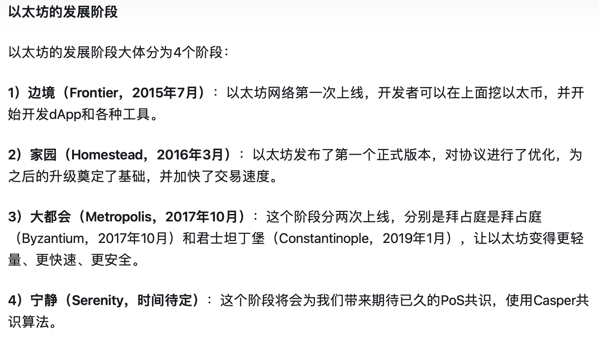
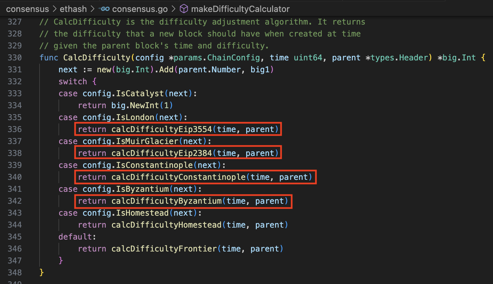
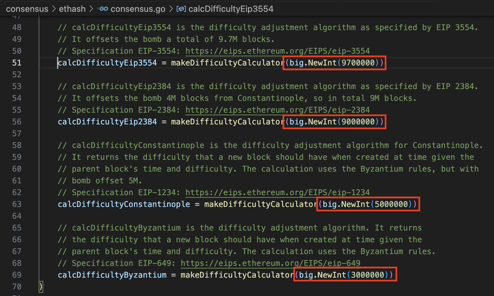

# 以太坊难度计算详解

参考链接；[https://zhuanlan.zhihu.com/p/140750633](https://zhuanlan.zhihu.com/p/140750633)

首先了解以太坊的各个发展阶段的名称：

仔细看看以下四个计算Difficulty的函数：

都是通过同一个函数（或者称其为：数学公式）`makeDifficultyCalculator`来生成的。
**区别**仅限于推迟难度炸弹的Block数量。

要想了解上面的这个`makeDifficultyCalculator`函数的数学公式究竟干了什么，请仔细阅读这篇PDF文档:

* [http://zhenxiao.com/blockchain/20-ETH.pdf](http://zhenxiao.com/blockchain/20-ETH.pdf)

* [doc/20-ETH.pdf](doc/20-ETH.pdf)

该文档详细说明了以太坊的难度计算细节。