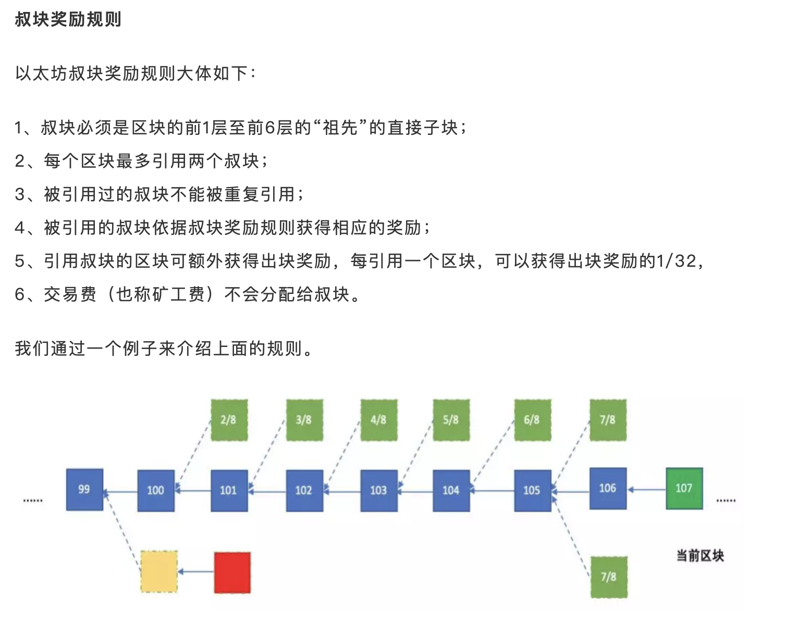
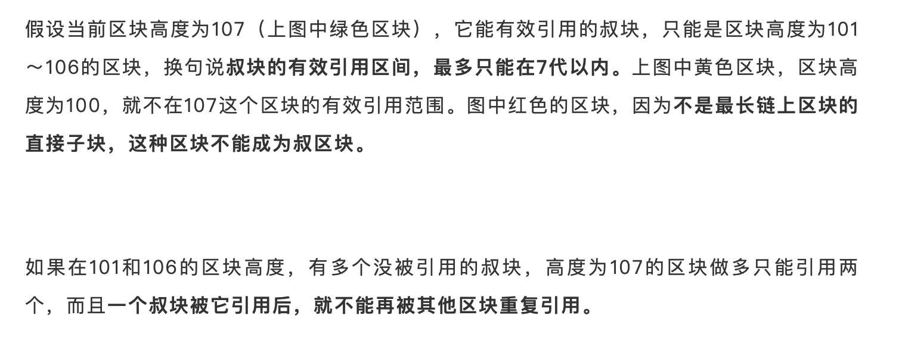
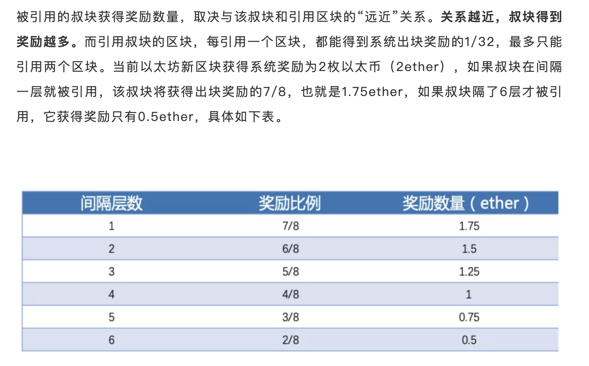
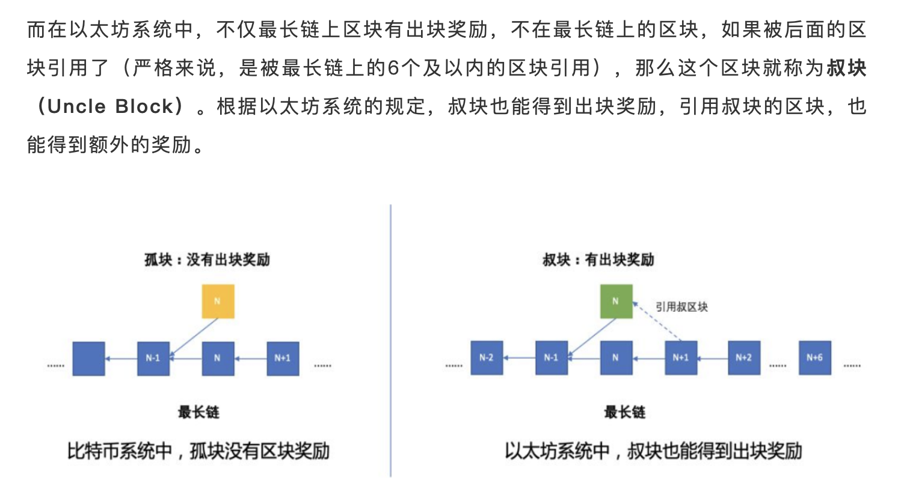

# 叔块和最重链

* [https://www.hellobtc.com/kp/kc/201904/1562.html](https://www.hellobtc.com/kp/kc/201904/1562.html)

上面的链接解释了：

* **比特币**和**以太坊**的**分叉**发生的概率比较
* 为什么需要叔块
* 以及叔块的奖励规则
    
    
    
    
