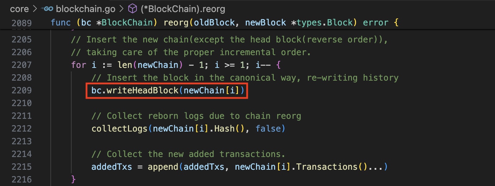

# 如何处理分叉(reorg)

* reorg函数声明：
    - 调用`reorg`函数之前，新旧两个链条上的`Block`都应该在本地存在且验证通过了
    
    - 下面是`reorg`函数的声明：
    

* 比较新块和旧块的**高度**
    - 构造各自的链条存放到`oldChain`和`newChain`中
    - **高度**高的`Block`放在`oldChain`或`newChain`数组**靠前**的位置
    - 同时**收集**需要delete的交易和log列表
    
    - 执行上面的代码之后，
        - `oldBlock`和`newBlock`的高度一定相等了。
        - 有可能`oldBlock`和`newBlock`就是同一个`Block`

* 接下来就找到这个公共的块`commonBlock`（两条链链接在一起的分叉点）
    
    - 如果`oldBlock`和`newBlock`的Hash相等，那么这两个块就是`commonBlock`
    - 否则，将`oldBlock`和`newBlock`追加到`oldChain`和`newChain`的数组末尾
    - 更新`oldBlock`和`newBlock`为各自的**父块**
    - 重新执行这个for循环

* 执行到了这里，就找到了公共的块。只需要将当前最长链的所有块依次写入数据库，并**设置当前链**标志位就表示reorg成功了。
    
    - 因为`oldChain`或`newChain`中，高度高的块在数组的靠前的位置
    - 所以需要反向遍历`newChain`，高度从小到大
    - 逐个`Block`的方式调用`writeHeadBlock`
        
        - `writeHeadBlock`里面对于每一个`Block`
        - 都在数据库里面写入了`CanonicalHash`值
        - 当然还有很多别的数据（在这里不是重点）
    - 同时收集对应块的`Logs`和`Txs`

* 到了这里，就需要处理收集到的交易数据了
    
    - 采`Batch`的方式（有点事务的意思）
        - 比较需要删除的`Tx`和新加入的`Tx`
        - 增量式的删除`Tx`数据
    - 同时还需要在本地将**所有比最新块的高度还高的块**的全局数据清理掉
        - 调用`rawdb.ReadCanonicalHash`函数判断是否存在全局头部标记
        - 调用`rawdb.DeleteCanonicalHash`函数删除**公认链**头部标记

