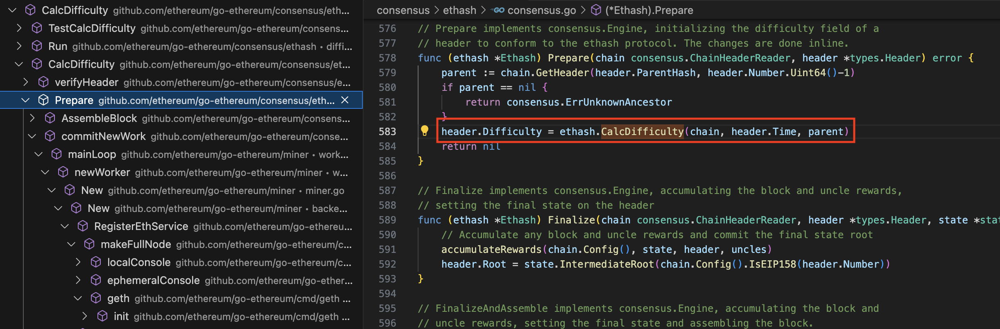
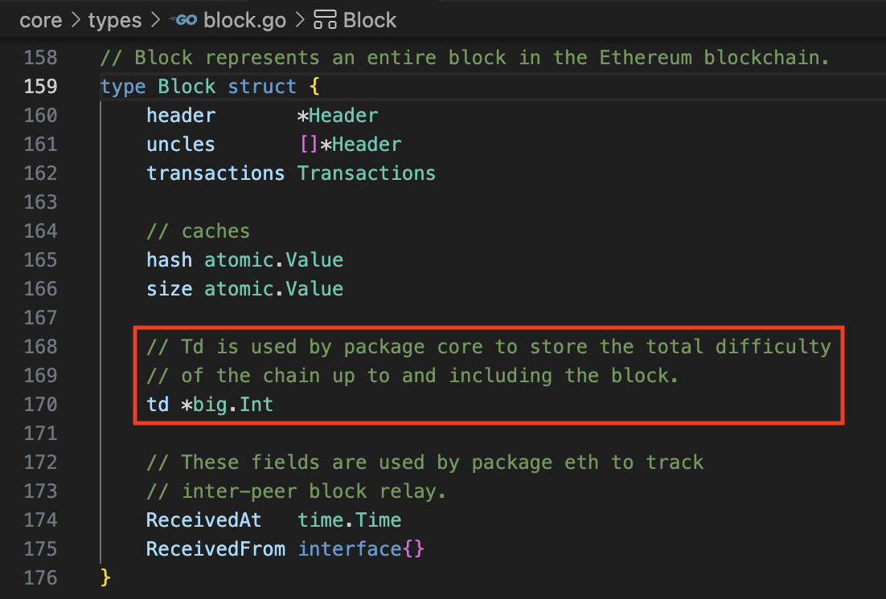

# 挖矿总难度

当前的**总难度**：由从genesis块开始到当前块的难度**累加和**。

1. 第一步，在挖矿的时候，计算Difficulty值，并将该值保存到每一个Block(包括Uncle)的Header里。

在此列举两个计算Difficulty的算法：
[https://github.com/ethereum/EIPs/issues/100](https://github.com/ethereum/EIPs/issues/100)

2. 校验难度值的时候，也用CalcDifficulty函数

3. 在insertChain里面动态的累加到Database的**Total Difficulty**中。

* 每次insertChain的调用，最初都是从genesis块开始的
* 可能有分枝，但是所在的分枝最初也是从genesis块开始累加Difficulty值到**Total Difficulty**里面
* 因为有snapshot的存在，这里的**Total Difficulty**的计算可能被优化
* 该Td值也会缓存到数据库里面，在重启客户端的时候有用到，不能只保存的内存中。
* 每个Block在本地Database里都有一个**Total Difficulty**值可用

本来以为，在insertChain里面动态的累加到Block的临时变量**td**里面，但是通过仔细查找后发现，这个**td**值在代码里面没有被使用！而是通过读写数据库来直接获取和写入**Total Difficulty**值。基本上确认！

